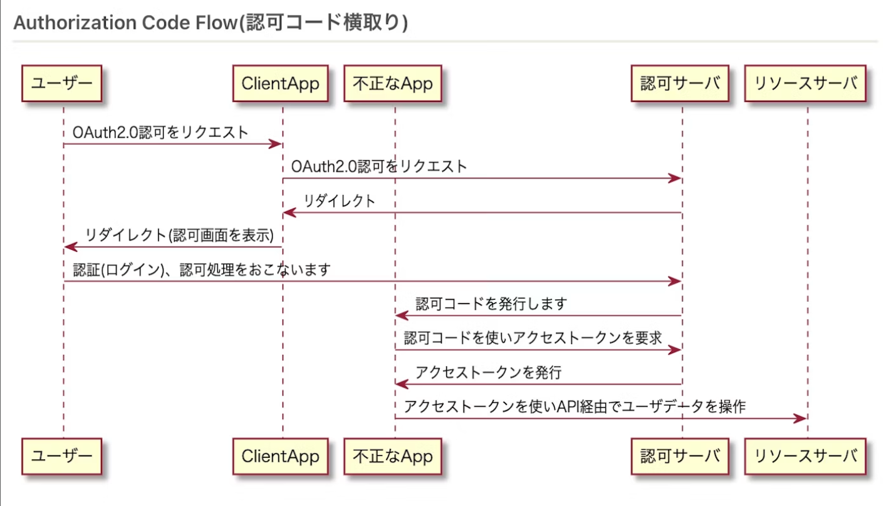
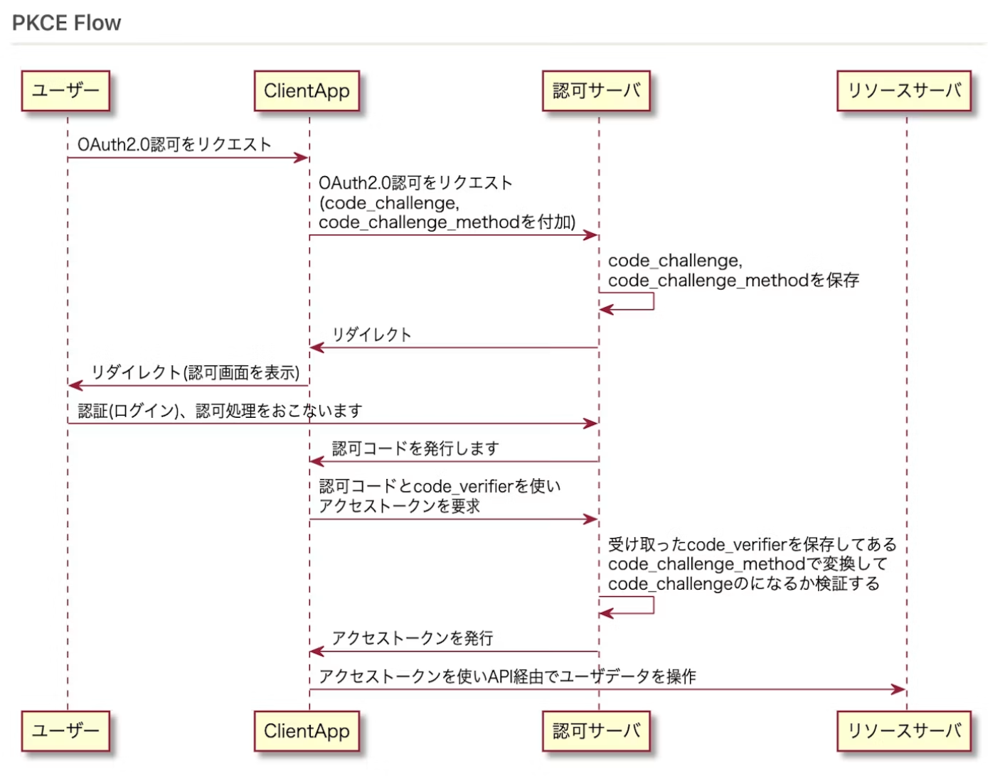

# supabase authを使う場合、アプリ側でエンドポイントは用意しなくても動く
Googleとかでログイン後supabase側が
認可コード取得→トークン交換→DB登録→アプリにトークン配布
までやってくれるので、アプリ側はわざわざエンドポイントを用意せずとも、getUser()みたいな関数だけでログイン情報を取得できる
ただ立てた方がデメリットがないし開発者目線もフローがわかりやすい

# Authorization Code Flow
よく想像するOAuthの認証フロー
1. クライアントが認可コードの発行を要請
2. ユーザーがログイン後、リダイレクトURI先に認可コードが渡る
3. エンドポイント側で認可コードを元手にアクセストークンを発行

ただし、OAuth認証フローでクライアントがモバイルアプリの場合、悪意あるアプリがコールバックURLを不正利用して認可コード取得→アクセストークンが取れる可能性がある

# PKCE フロー

このフローだと悪意あるCallback先はcode_verfierがないのでアクセストークンが取れない

# supabaseの場合
Supabase↔︎Googelサーバー間でのPKCEフローに加えて
Supaabse↔︎アプリでもOAuth認証のようなフローを踏んで、アプリ側にもログイン情報を渡している

参考：https://qiita.com/nobuo_hirai/items/8cd8140e7d3970e4e094