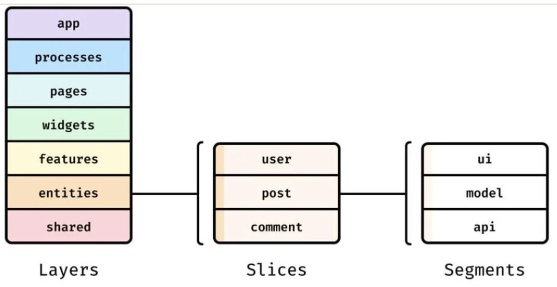

# FSD

https://fsd.how/ja/docs/get-started/overview/

## 概要

こんな感じで切るアーキテクチャ
前提として、FSDは主にフロントエンドを対象にしている

- 依存は必ず上から下の一方通行

## featuresについて
FSDの重要な原則
＝全部をFeatureにしなくてもいい

- 複数の page / widget から再利用されるか
- 単独で成立する凝集した UI トリガー＋ロジックを持つか（ボタン + mutation + 楽観更新など）
- 切り出さないと page / widget が太りすぎるか

どれか一つでも当てはまったら、widgetsやpages直下におくべき

## レイヤーの切り出し判断基準
最初はpages
その後複数ページ、ファイルで使われる or 肥大化してきたら以下の条件分岐で各レイヤーに切り出す

ユーザー操作一つ
＝features

ドメイン、データ
＝entities

複数features, entitiesを使うページの一区画
＝widgets

ビジネス非依存のUI / utils
＝shered

## Layers

### app

アプリケーションの起動に必要なものをまとめる
ルーティングとかエントリーポイントとか、プロバイダー、グローバルスタイルetc...
page.tsx以外のページ固有のファイルはpagesレイヤーに切り出してインポートする

### pages

ページ単位でフォルダを切る
ページ固有の機能はここにまとめておく
uiやmodelが複数ページで使われるようになったら、widgetsやfeaturesに切り出すことを検討する

### entities
そのプロダクト**固有**のドメインをまとめる場所
例えばsupabaseなど他のプロダクトでも通用するような固まりはsharedにおくべき

### shared
supabaseはshared/ではなく、shared/api/supabase/
のなかで切るべき
SegmentsのAPIは実行環境の話ではなく、バックエンドと通信する層の話

## Segments

### api
apiは実行環境の話ではなく、バックエンドと通信する固まりの話
なのでsupabaseのインスタンスを生成するclient.tsはクライアントで実行するけど、
api/内に置くのが綺麗
**バックエンドのAPIエンドポイントを置く場所ではない**

## Next.jsとの相性
あくまでFSDはフロントのアーキテクチャ
server-onlyな関数はsegmentのapiには置くべきじゃない

### app router, pages　router
Next.jsではappフォルダ配下を自動でルーティングしてくれる
＝FSDと名前が正徳する

対処法としては
- app/*/page.tsxは FSDのpages sliceをimportして描画するだけの薄いファイルにする
- FSD本体はsrc/に寄せて、Nextのapp/はルーティング専用として割り切る（FSDの app/pages　layerの役割を吸収）

## 公開APIについて

FSDは各フォルダ配下に他モジュールからインポートしてもらう用の公開API（index.ts）を用意するのを推奨している

特定のオブジェクトのアクセスを制限したり、スライス内の構造的な変更から守るため（？）

めんどくさくてワイルドカードでre-exportしたくなるが、index.tsに切り出す意味がなくなるのでやめるべき

ちなみに、index.tsというファイル名は特別な動作をする。インポート時にファイル名を書かなくてもインポートできる

### クロスインポート

基本同じレイヤーの別のスライスのインポートは禁止されてる
けど、お互いに参照し合って成り立つエンティティなど仕方ない場面も多い

この場合、以下の用に@xフォルダとhoge.tsを切って専用の公開APIを立てる。

ただこのクロスインポートは最小限に抑えるべき

### index.tsの問題

index.tsはバンドラーやフレームワーク側で問題が起きる可能性がある
- 循環インポートでランタイムエラー
- ツリーシェイキングしづらい
  - 特にshadcnみたいなuiライブラリはui配下でindex.tsされると使われてないものが判断しづらい
    - コンポーネントごとにre-exportするのが解決策として挙げられてるけどだるそう

### 公開API回避して直接インポートできる問題
これは専用のアーキテクチャリンターがあるらしい
https://github.com/feature-sliced/steiger

### そもそも大量にインデックスが存在するとパフォーマンスが落ちる
https://tkdodo.eu/blog/please-stop-using-barrel-files

対処法
- shared内のコンポーネント、ライブラリのために別々のindex.tsを持つ
- スライスを持ってるレイヤーのセグメントにindex.tsを持たせない