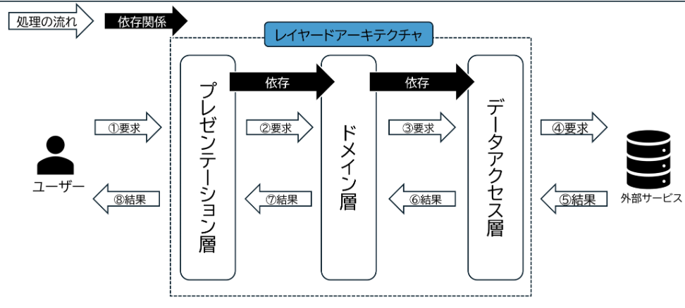

# レイヤードアーキテクチャー

## 概要
- システムを複数のレイヤーに分割する
- 責務を分離させる

## プレゼンテーション層

プレゼンテーション層は、ユーザーとシステム間のインターフェースを担当するレイヤーです。
ユーザーからのリクエストに対して適切なレスポンスを返す役割を持っています。

役割と機能：

リクエストデータの受け取り
リクエストデータのバリデーション/フォーマット変換
レスポンスデータのバリデーション/フォーマット変換
リクエスト元へのレスポンス
ポイント：

ドメイン層に依存します。
外部サービス（データベース等）と直接的に通信することは許容せず、ドメイン層を介してデータをやり取りします。

## ドメイン層
ドメイン層は、システムのコアな機能であるビジネスロジックを実装するレイヤーです。このレイヤーでは、具体的な業務処理やデータの処理方法が定義されます。
ビジネスロジックの定義はチーム内で検討した上で共通認識を持つことが重要と考えています。

役割と機能：

ビジネスロジックの実装
データの処理や計算
トランザクション管理
ポイント：

データアクセス層に依存します。
システムのコアとなるビジネスロジックを実装します。
外部サービス（データベース等）と直接的に通信することは許容せず、データアクセス層を介してデータをやり取りします。

## データアクセス層
データアクセス層は、データベースや外部サービスとのやり取りを管理するレイヤーです。データの保存や取得、更新、削除などの操作を担当します。

役割と機能：

外部サービス接続の管理
データのCRUD操作（Create, Read, Update, Delete）
データの永続化
ポイント：

他のレイヤーに依存しない。
ORM（Object-Relational Mapping）ツールなどを使用することが多いイメージです。
